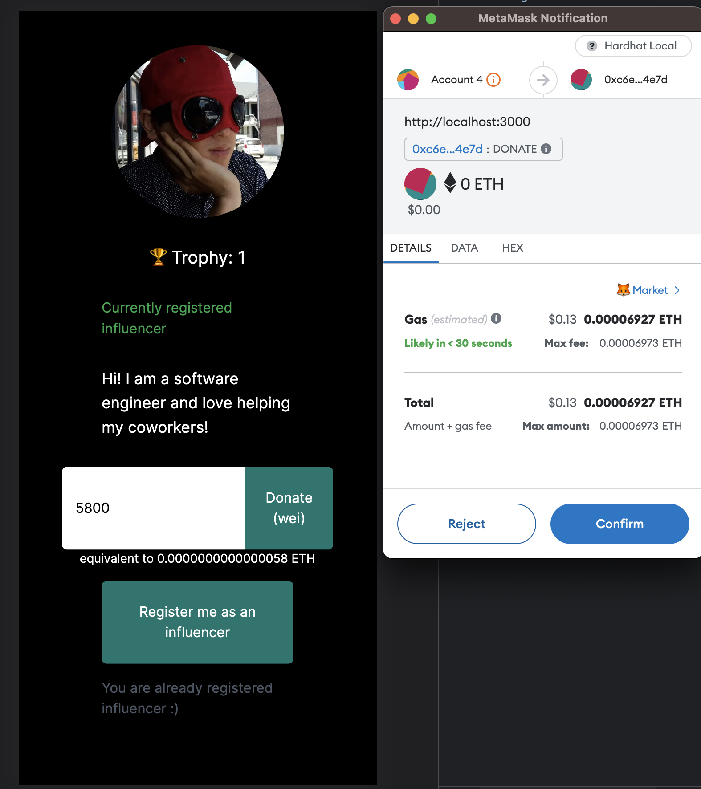

# Good influencer
##  What is it?
Have you ever felt like "thank you so much!" is not enough for someone who constantly helps you at work?
Sometimes you have a co-worker who is passionate and encourages other co-workers which leads your project much in positive ways.
I call them good influencers and believe they deserve more.
Therefore I created this app which influencers can receive donations as Ether.
Also the influencers will receive a trophy whenever they get a donation which will permanently carved in the Blockchain and this can be a proof of great team player!

## Demo
[Link](https://good-influencer-q5v9fs7li-taewa.vercel.app/) (A wallet is required to connect)

## Tech stack
* Solidity (yul)
* Upgradeable contracts
* Hardhat
* Unit & integration tests
* Typescript
* Frontend (NextJs)
* Backend (Express & MongoDB)
* Deploy to the testnet (Sepolia)
* Vercel (Frontend & Backend)

## Screenshot


# Tests

```shell
npx hardhat test
```

# Run & deploy app
```shell
npx hardhat node
npx hardhat run scripts/deploy.ts
```


